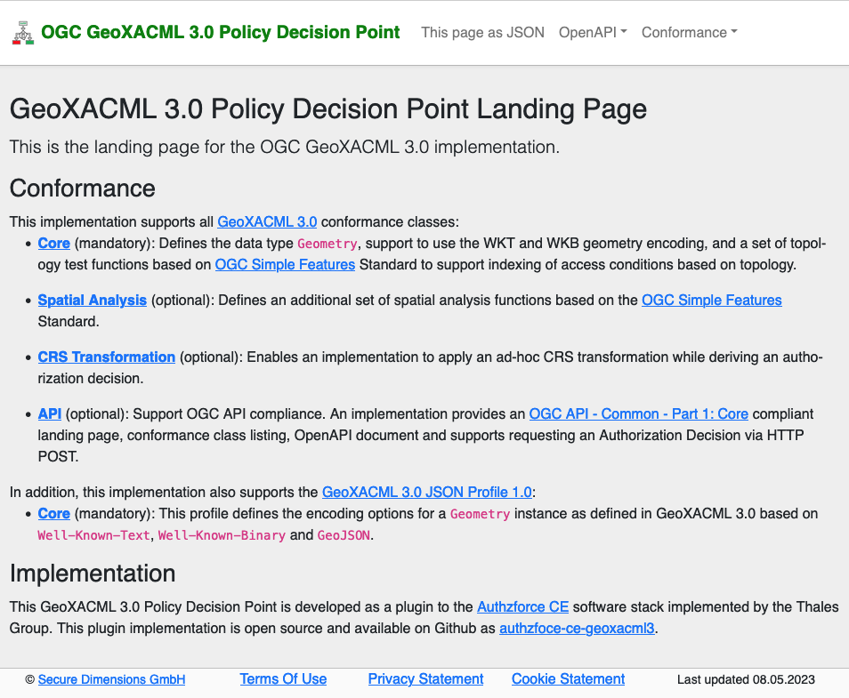

# GeoXACML 3.0 Policy Decision Point
This implementation is an open source implementation of the following OGC Draft Standards
* [OGC Geospatial eXtensible Access Control Markup Language (GeoXACML) 3.0](docs.ogc.org/DRAFTS/22-049.html)
* [OGC Geospatial eXtensible Access Control Markup Language (GeoXACML) 3.0 JSON Profile v1.0](docs.ogc.org/DRAFTS/22-050.html)

This GeoXACML 3.0 implementation is a plugin to the [Authzforce CE](https://github.com/authzforce) software stack and tested with Authzforce CE Server version 11.0.1.

This implementation is available under the Apache 2.0 license.

## Installation

### Java 11 SDK
Please install the JAVA 11 SDK for your OS.

### Install Authzforce CE
Follow the [instructions](https://github.com/authzforce/server) how to deploy the Authzforce CE Server version 11.0.1.

The installation directory is further referred to as `<authzforce-server>`.

### Update Authzforce CE rest-api-model
Please follow the [instructions](https://github.com/securedimensions/authzforce-ce-geoxacml3-rest-api-model) how to update the Rest-API-Model JAR file. 


### Installation of the GeoXACML 3.0 Policy Decision Point
Simply clone this repository and execute maven using Java 11.

```shell
$ git clone https://github.com/securedimensions/authzforce-ce-geoxacml3
$ cd authzforce-ce-geoxacml3
$ mvn install
$ cp target/authzforce-ce-geoxacml3-1.0.jar <authzforce-server>/webapp/WEB-INF/lib
$ cp target/lib/jts-core-*.jar <authzforce-server>/webapp/WEB-INF/lib
$ cp target/lib/jts-io-common-*.jar <authzforce-server>/webapp/WEB-INF/lib
$ cp target/lib/jul-to-slf4j-2.0.5.jar <authzforce-server>/webapp/WEB-INF/lib
$ cp target/lib/proj4j-1.1.5.jar <authzforce-server>/webapp/WEB-INF/lib
$ cp target/lib/freemarker-2.3.32.jar <authzforce-server>/webapp/WEB-INF/lib
```

## Configuration
For enabling the `authzforce-ce-geoxacml3` plugin with the Authzforce CE Server deployment, a few configuration steps are required.

### Enable GeoXACML extension
The PDP configuration must be updated to contain the GeoXACML 3.0 `geometry` data-type and functions. Please replace the following files with the XML from below:
* `<authzforce-server>/data/domains/A0bdIbmGEeWhFwcKrC9gSQ/pdp.xml` ensures that the default domain supports GeoXACML 3.0 
* `<authzforce-server>/conf/domain.tmpl/pdp.xml` ensures that each newly created domains supports GeoXACML 3.0

```xml
<?xml version="1.0" encoding="UTF-8" standalone="yes"?>
<pdp xmlns="http://authzforce.github.io/core/xmlns/pdp/8" xmlns:ns2="urn:oasis:names:tc:xacml:3.0:core:schema:wd-17" version="8.0" standardDatatypesEnabled="true" standardFunctionsEnabled="true" standardCombiningAlgorithmsEnabled="true" standardAttributeProvidersEnabled="true" xPathEnabled="false" strictAttributeIssuerMatch="false" maxIntegerValue="2147483647" maxVariableRefDepth="10" maxPolicyRefDepth="10" clientRequestErrorVerbosityLevel="0">
    <!-- GeoXACML 3.0 Geometry data-type -->
    <attributeDatatype>urn:ogc:def:geoxacml:3.0:data-type:geometry</attributeDatatype>
    <!-- GeoXACML 3.0 Core Geometry Functions -->
    <function>urn:ogc:def:geoxacml:3.0:function:geometry-dimension</function>
    <function>urn:ogc:def:geoxacml:3.0:function:geometry-type</function>
    <function>urn:ogc:def:geoxacml:3.0:function:geometry-srid</function>
    <function>urn:ogc:def:geoxacml:3.0:function:geometry-is-empty</function>
    <function>urn:ogc:def:geoxacml:3.0:function:geometry-is-simple</function>
    <function>urn:ogc:def:geoxacml:3.0:function:geometry-srid-equals</function>
    <function>urn:ogc:def:geoxacml:3.0:function:geometry-ensure-srid</function>
    <function>urn:ogc:def:geoxacml:3.0:function:geometry-precision</function>
    <function>urn:ogc:def:geoxacml:3.0:function:geometry-ensure-precision</function>
    <function>urn:ogc:def:geoxacml:3.0:function:geometry-has-precision</function>
    <!-- GeoXACML 3.0 Core Spatial Relations Functions -->
    <function>urn:ogc:def:geoxacml:3.0:function:geometry-equals</function>
    <function>urn:ogc:def:geoxacml:3.0:function:geometry-disjoint</function>
    <function>urn:ogc:def:geoxacml:3.0:function:geometry-intersects</function>
    <function>urn:ogc:def:geoxacml:3.0:function:geometry-touches</function>
    <function>urn:ogc:def:geoxacml:3.0:function:geometry-crosses</function>
    <function>urn:ogc:def:geoxacml:3.0:function:geometry-within</function>
    <function>urn:ogc:def:geoxacml:3.0:function:geometry-contains</function>
    <function>urn:ogc:def:geoxacml:3.0:function:geometry-overlaps</function>
    <function>urn:ogc:def:geoxacml:3.0:function:geometry-relate</function>
    <!-- GeoXACML 3.0 Core Analysis Functions -->
    <function>urn:ogc:def:geoxacml:3.0:function:geometry-length</function>
    <function>urn:ogc:def:geoxacml:3.0:function:geometry-area</function>
    <function>urn:ogc:def:geoxacml:3.0:function:geometry-distance</function>
    <function>urn:ogc:def:geoxacml:3.0:function:geometry-distance-equals</function>
    <function>urn:ogc:def:geoxacml:3.0:function:geometry-is-within-distance</function>
    <!-- GeoXACML 3.0 Bag/Set Functions  -->
    <function>urn:ogc:def:geoxacml:3.0:function:geometry-bag-one-and-only</function>
    <function>urn:ogc:def:geoxacml:3.0:function:geometry-bag-size</function>
    <function>urn:ogc:def:geoxacml:3.0:function:geometry-is-in-bag</function>
    <function>urn:ogc:def:geoxacml:3.0:function:geometry-bag</function>
    <function>urn:ogc:def:geoxacml:3.0:function:geometry-bag-to-collection</function>
    <function>urn:ogc:def:geoxacml:3.0:function:geometry-bag-from-collection</function>
    <function>urn:ogc:def:geoxacml:3.0:function:geometry-bag-at-least-one-member-of</function>
    <function>urn:ogc:def:geoxacml:3.0:function:geometry-bag-intersection</function>
    <function>urn:ogc:def:geoxacml:3.0:function:geometry-bag-union</function>
    <function>urn:ogc:def:geoxacml:3.0:function:geometry-bag-subset</function>
    <function>urn:ogc:def:geoxacml:3.0:function:geometry-set-equals</function>
    <!-- GeoXACML 3.0 Spatial Analysis Functions -->
    <function>urn:ogc:def:geoxacml:3.0:function:geometry-envelope</function>
    <function>urn:ogc:def:geoxacml:3.0:function:geometry-boundary</function>
    <function>urn:ogc:def:geoxacml:3.0:function:geometry-buffer</function>
    <function>urn:ogc:def:geoxacml:3.0:function:geometry-convex-hull</function>
    <function>urn:ogc:def:geoxacml:3.0:function:geometry-intersection</function>
    <function>urn:ogc:def:geoxacml:3.0:function:geometry-union</function>
    <function>urn:ogc:def:geoxacml:3.0:function:geometry-difference</function>
    <function>urn:ogc:def:geoxacml:3.0:function:geometry-sym-difference</function>
    <function>urn:ogc:def:geoxacml:3.0:function:geometry-centroid</function>

    <policyProvider xmlns:xsi="http://www.w3.org/2001/XMLSchema-instance" xmlns:ns4="http://authzforce.github.io/pap-dao-flat-file/xmlns/pdp-ext/4" xsi:type="ns4:StaticFlatFileDaoPolicyProviderDescriptor" policyLocationPattern="${PARENT_DIR}/policies/*.xml" id="rootPolicyProvider"/>
    <rootPolicyRef policySet="true">root</rootPolicyRef>
    <ioProcChain>
        <!-- GeoXACML 3.0 application/geoxacml+xml pre-processor -->
        <requestPreproc>urn:de:securedimensions:feature:pdp:request-preproc:geoxacml-xml:default-lax</requestPreproc>
    </ioProcChain>
    <ioProcChain>
        <!-- GeoXACML 3.0 application/geoxacml+json pre-processor -->
        <requestPreproc>urn:de:securedimensions:feature:pdp:request-preproc:geoxacml-json:default-lax</requestPreproc>
        <!-- GeoXACML 3.0 application/geoxacml+json post-processor -->
        <resultPostproc>urn:de:securedimensions:feature:pdp:response-postproc:geoxacml-json:default-lax</resultPostproc>
    </ioProcChain>
</pdp>
```

### Enable GeoXACML Media Types

In file `<authzforce>/webapp/WEB-INF/beans.xml`

* Update `<beans profile="-fastinfoset">`
```xml
<util:list id="xacmlJsonMediaTypes">
         <!-- OASIS JSON Profile of XACML 3.0 -->
         <value>application/xacml+json</value>
         <!-- OGC JSON Profile of GeoXACML 3.0 -->
         <value>application/geoxacml+json</value>
      </util:list>
      <util:list id="xacmlXmlMediaTypes">
         <!-- OASIS XACML 3.0 -->
         <value>application/xacml+xml</value>
         <!-- OGC GeoXACML 3.0 -->
         <value>application/geoxacml+xml</value>
      </util:list>
```

* Update `<bean class="org.ow2.authzforce.jaxrs.util.AcceptMediaTypeCheckingRequestFilter">`
```xml
<constructor-arg>
  <util:list>
     <value>application/xml</value>
     <!-- IETF RFC 7061 -->
     <value>application/xacml+xml</value>
     <value>application/json</value>
     <!-- OASIS JSON Profile of XACML 3.0 -->
     <value>application/xacml+json</value>
     <!-- GeoXACML 3.0 -->
     <value>application/geoxacml+xml</value>
     <value>application/geoxacml+json</value>
  </util:list>
</constructor-arg>
```

* Update `<bean class="org.ow2.authzforce.webapp.NamespaceCollectingCxfJAXBElementProvider">`
```xml
<property name="produceMediaTypes" ref="xacmlXmlMediaTypes" />
<property name="consumeMediaTypes" ref="xacmlXmlMediaTypes" />
```

* Ensure this section contains `<bean class="org.ow2.authzforce.webapp.JsonRiCxfJaxrsProvider">`
```xml
 <property name="produceMediaTypes" ref="xacmlJsonMediaTypes" />
<property name="consumeMediaTypes" ref="xacmlJsonMediaTypes" />
```

* Ensure this section contains `<bean class="org.ow2.authzforce.webapp.org.apache.cxf.jaxrs.provider.json.JSONProvider">`
```xml
 <property name="produceMediaTypes" ref="defaultJsonMediaTypes" />
<property name="consumeMediaTypes" ref="xacmlJsonMediaTypes" />
```

### Configure loading GeoXACML JSON schema
The GeoXACML request and response uses an extended JSON schema. It is therefore required to copy the following files from the `conf` directory into the `<authzforce>/conf` directory.

```shell
$ cp conf/*.json <authzforce>/conf
```

### Enable the OGC API Common conformance class
The GeoXACML 3.0 Policy Decision Point implements the OGC API Common conformance class via a Tomcat Filter. This filter needs to be activated.

In `<authzforce>/webapp/WEB-INF/web.xml` insert the GeoPDP Filter as the last filter. It is also required to add the `default` Servlet to allow access to the static files required for the HTML page rendering.

```xml
   <filter>
      <description></description>
      <filter-name>GeoPDP</filter-name>
      <filter-class>de.securedimensions.geoxacml3.pdp.ogc.GeoPDP</filter-class>
   </filter>
<filter-mapping>
    <filter-name>exceptionFilter</filter-name>
    <servlet-name>CXFServlet</servlet-name>
</filter-mapping>
<filter-mapping>
    <filter-name>GeoPDP</filter-name>
    <servlet-name>CXFServlet</servlet-name>
    <url-pattern>/</url-pattern>
    <url-pattern>/api</url-pattern>
    <url-pattern>/conformance</url-pattern>
    <url-pattern>/decision</url-pattern>
    <url-pattern>/cookies.html</url-pattern>
    <url-pattern>/privacy.html</url-pattern>
    <url-pattern>/terms.html</url-pattern>
</filter-mapping>
<servlet-mapping>
    <servlet-name>default</servlet-name>
    <url-pattern>/static/*</url-pattern>
</servlet-mapping>
```

## Test
Once you have applied the installation and configuration steps, open the PDP URL in your Web Browser. For example [http://localhost:8080/authzforce-ce/domains/A0bdIbmGEeWhFwcKrC9gSQ/pdp](http://localhost:8080/authzforce-ce/domains/A0bdIbmGEeWhFwcKrC9gSQ/pdp).

Now, you should see the OGC GeoXACML 3.0 Policy Decision Point Landing Page.



## Ubuntu 22.04 from Scratch

''''
1  apt update
2  apt upgrade
3  apt install java11-sdk
4  apt install openjdk-11-jdk
5  apt install git
6  apt install maven
7  apt install gdebi-core
8  wget https://repo1.maven.org/maven2/org/ow2/authzforce/authzforce-ce-server-dist/11.0.1/authzforce-ce-server-dist-11.0.1.deb
9  gdebi authzforce-ce-server-dist-11.0.1.deb
10  git clone -b custom-mediatype-geoxacml https://github.com/securedimensions/authzforce-ce-geoxacml3-rest-api-model.git
11  cd authzforce-ce-geoxacml3-rest-api-model
12  mvn versions:set -DnewVersion=6.0.0-geoxacml
13  mvn clean package
14  rm /opt/authzforce-ce-server/webapp/WEB-INF/lib/authzforce-ce-rest-api-model-6.0.0.jar
15  cp target/authzforce-ce-rest-api-model-6.0.0-geoxacml.jar /opt/authzforce-ce-server/webapp/WEB-INF/lib/.
16  cd ..
17  git clone https://github.com/securedimensions/authzforce-ce-geoxacml3
18  cd authzforce-ce-geoxacml3
19  mvn install
20  cp target/authzforce-ce-geoxacml3-1.0.jar /opt/authzforce-ce-server/webapp/WEB-INF/lib/.
21  cp target/lib/jts-core-1.19.0.jar /opt/authzforce-ce-server/webapp/WEB-INF/lib/.
22  cp target/lib/jts-io-common-1.19.0.jar /opt/authzforce-ce-server/webapp/WEB-INF/lib/.
23  cp target/lib/jul-to-slf4j-2.0.5.jar /opt/authzforce-ce-server/webapp/WEB-INF/lib/.
24  cp target/lib/proj4j-1.1.5.jar /opt/authzforce-ce-server/webapp/WEB-INF/lib/.
25  cp target/lib/freemarker-2.3.32.jar /opt/authzforce-ce-server/webapp/WEB-INF/lib/.
26  vi /opt/authzforce-ce-server/data/domains/A0bdIbmGEeWhFwcKrC9gSQ/pdp.xml
27  vi /opt/authzforce-ce-server/conf/domain.tmpl/pdp.xml
28  vi webapp/WEB-INF/beans.xml
'''' 

vi web.xml
add below commented filter section
''''
   <filter>
      <description></description>
      <filter-name>GeoPDP</filter-name>
      <filter-class>de.securedimensions.geoxacml3.pdp.ogc.GeoPDP</filter-class>
   </filter>
''''

''''